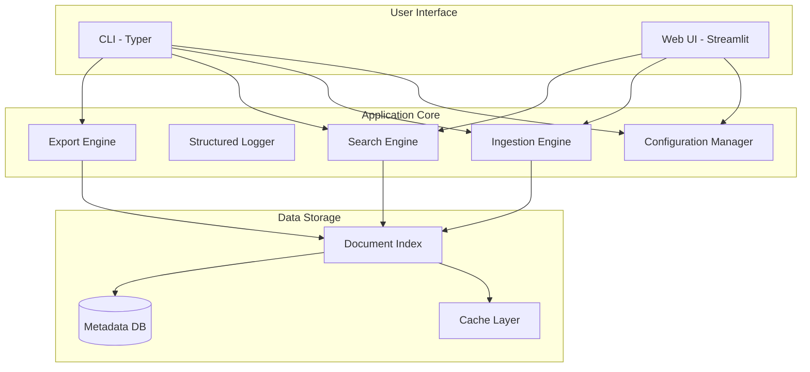

# PDF Context Narrator

A Python 3.11+ production-ready CLI and web tool for ingesting, searching, and analyzing PDF documents with structured logging, multiple deployment profiles, and comprehensive monitoring.

## Features

- 📥 **Ingest**: Process and index PDF documents with parallel processing
- 🔍 **Search**: Query indexed documents with powerful search capabilities
- 📄 **Summarize**: Generate summaries of PDF content
- 📅 **Timeline**: Create chronological views of document events
- 📤 **Export**: Export data in multiple formats (JSON, CSV, Markdown)
- 🌐 **Web UI**: Optional Streamlit-based web interface
- 📊 **Structured Logging**: JSON logging with operation tracking
- ⚙️ **Config Profiles**: Pre-configured profiles for local, offline, and cloud deployments
- 🔒 **Security**: Built-in security scanning and best practices
- 🚀 **CI/CD**: Automated testing and deployment pipelines

## Architecture

### High-Level System Design



See [Architecture Documentation](docs/ARCHITECTURE.md) for detailed system design.
A Python 3.11 CLI tool for ingesting, searching, and analyzing PDF documents with large-file resilience.

## Features

- 📥 **Ingest**: Process and index PDF documents with resilience features
  - **Streaming page processing** for memory efficiency
  - **Automatic checkpoints** every N pages (configurable)
  - **Resumable runs** to continue from interruption
  - **Multiprocessing support** for faster processing
  - **Progress bars** for visual feedback
  - **Memory limit monitoring** (optional, requires psutil)
A Python 3.11 CLI tool for ingesting, searching, and analyzing PDF documents with semantic search capabilities.

## Features

- 📥 **Ingest**: Process and index PDF documents
- 🔍 **Search**: Query indexed documents with powerful semantic search
- 📄 **Summarize**: Generate summaries of PDF content
- 📅 **Timeline**: Create chronological views of document events
- 📤 **Export**: Export data in multiple formats (JSON, CSV, Markdown)
- 🧩 **Chunking**: Semantic text chunking with configurable size and overlap
- 🔢 **Embeddings**: Text embeddings using Sentence Transformers
- 🗄️ **Vector Index**: FAISS-based vector index for efficient similarity search
- 📥 **Ingest**: Process and index PDF documents with OCR support
- 🔍 **Search**: Query indexed documents with powerful search
- 📄 **Summarize**: Generate summaries of PDF content
- 📅 **Timeline**: Create chronological views of document events
- 📤 **Export**: Export data in multiple formats (JSON, CSV, Markdown)
- 🔎 **OCR**: Optical Character Recognition for scanned pages and images

## Large-File Resilience

The PDF processor is designed to handle large files (1000+ pages) without crashing:

- **Streaming Processing**: Pages are processed one at a time, not loading the entire PDF into memory
- **Checkpoints**: State is saved every N pages (configurable via `--batch-size`)
- **Resume Capability**: If processing is interrupted, use `--resume` to continue from the last checkpoint
- **Multiprocessing**: Use `--workers` to process pages in parallel (where applicable)
- **Progress Tracking**: Visual progress bars show processing status
- **Memory Monitoring**: Optional memory limit to prevent out-of-memory errors

## Project Structure

```
pdf_context_narrator/
├── src/
│   └── pdf_context_narrator/
│       ├── __init__.py
│       ├── __main__.py
│       ├── cli.py          # CLI interface with Typer
│       ├── config.py       # Configuration with profile support
│       └── logger.py       # Structured logging
├── streamlit_app/          # Optional web UI
│   ├── app.py             # Streamlit application
│   └── README.md
├── tests/                  # Test suite
│   ├── test_cli.py
│   ├── test_config.py
│   ├── test_logger.py
│   └── test_e2e.py        # End-to-end integration tests
├── configs/                # Configuration profiles
│   ├── local.yaml         # Local development
│   ├── offline.yaml       # Offline mode
│   └── cloud.yaml         # Cloud deployment
├── docs/                   # Documentation
│   ├── ARCHITECTURE.md    # System architecture
│   └── TROUBLESHOOTING.md # Troubleshooting guide
├── .github/
│   └── workflows/
│       └── ci.yml         # CI/CD pipeline
├── .env.example           # Environment variables template
├── requirements.txt       # Core dependencies
├── requirements-streamlit.txt  # Optional UI dependencies
├── pyproject.toml         # Project configuration
│       ├── config.py       # Configuration management with Pydantic
│       ├── logger.py       # Logging setup
│       ├── chunking.py     # Semantic text chunking
│       ├── embeddings.py   # Embeddings abstraction
│       └── index.py        # FAISS index manager
│       └── ocr.py          # OCR processing for scanned documents
├── tests/                   # Test files
├── configs/                 # Configuration files
├── docs/                    # Documentation
├── .env.example            # Environment variables template
├── requirements.txt        # Python dependencies
└── README.md              # This file
```

## Prerequisites

- Python 3.11 or higher
- pip (Python package manager)
- Tesseract OCR (for OCR functionality)
  - Ubuntu/Debian: `sudo apt-get install tesseract-ocr poppler-utils`
  - macOS: `brew install tesseract poppler`
  - Windows: Download from [GitHub releases](https://github.com/UB-Mannheim/tesseract/wiki)

## Installation

### Linux / macOS

1. Clone the repository:
```bash
git clone https://github.com/wesire/PDF-Scanner.git
cd PDF-Scanner
```

2. Create and activate a virtual environment (recommended):
```bash
python3.11 -m venv venv
source venv/bin/activate
```

3. Install dependencies:
```bash
pip install --upgrade pip
pip install -c constraints.txt -r requirements.txt
pip install -e .
```

4. (Optional) Install development dependencies:
```bash
pip install -c constraints.txt -r requirements-dev.txt
```

5. (Optional) Install Streamlit UI:
```bash
pip install -c constraints.txt -r requirements-streamlit.txt
```

6. Configure environment variables:
```bash
cp .env.example .env
# Edit .env with your preferred settings
```

### Windows (Git Bash)

**Prerequisites:**
- Install [Python 3.11+](https://www.python.org/downloads/) (ensure "Add Python to PATH" is checked during installation)
- Install [Git for Windows](https://git-scm.com/download/win) (includes Git Bash)
- Install [Tesseract OCR](https://github.com/UB-Mannheim/tesseract/wiki) for OCR functionality
- Install [Poppler](https://github.com/oschwartz10612/poppler-windows/releases/) for pdf2image support

1. Open Git Bash and clone the repository:
```bash
git clone https://github.com/wesire/PDF-Scanner.git
cd PDF-Scanner
```

2. Create and activate a virtual environment:
```bash
# Create virtual environment
python -m venv venv

# Activate virtual environment (Git Bash)
source venv/Scripts/activate
```

3. Upgrade pip and install dependencies:
```bash
# Upgrade pip
pip install --upgrade pip

# Install runtime dependencies
pip install -c constraints.txt -r requirements.txt

# Install the package in editable mode
pip install -e .
```

4. (Optional) Install development dependencies:
```bash
pip install -c constraints.txt -r requirements-dev.txt
```

5. (Optional) Install Streamlit UI dependencies:
```bash
pip install -c constraints.txt -r requirements-streamlit.txt
```

6. Configure environment variables:
```bash
# Copy example environment file
cp .env.example .env

# Edit with nano or your preferred editor
nano .env
# Or open in notepad:
# notepad .env
```

7. Add Tesseract and Poppler to your PATH (if not already done):
```bash
# Add to ~/.bashrc or set temporarily in your session
export PATH="/c/Program Files/Tesseract-OCR:$PATH"
export PATH="/c/path/to/poppler/bin:$PATH"

# Verify installation
tesseract --version
pdfimages --version
```

**Note:** On Windows, replace forward slashes with backslashes for Windows-style paths when needed, or use forward slashes in Git Bash which will auto-convert.

### Alternative: Windows PowerShell / Command Prompt

If you prefer PowerShell or Command Prompt instead of Git Bash:

```powershell
# PowerShell
git clone https://github.com/wesire/PDF-Scanner.git
cd PDF-Scanner

# Create and activate virtual environment
python -m venv venv
.\venv\Scripts\Activate.ps1

# Install dependencies
pip install --upgrade pip
pip install -c constraints.txt -r requirements.txt
pip install -e .
```

Or Command Prompt:
```cmd
REM Command Prompt
git clone https://github.com/wesire/PDF-Scanner.git
cd PDF-Scanner

REM Create and activate virtual environment
python -m venv venv
venv\Scripts\activate.bat

REM Install dependencies
pip install --upgrade pip
pip install -c constraints.txt -r requirements.txt
pip install -e .
```

## Usage

### Python API

```python
from src.pdf_text_extractor import PDFTextExtractor

# Initialize extractor
extractor = PDFTextExtractor(output_dir="data/extracted")

# Extract text from a PDF
output_path = extractor.process_pdf("path/to/your/document.pdf")

# Or extract specific pages
page_data = extractor.extract_page("path/to/document.pdf", page_num=0)
```

### Command Line

```bash
python example.py path/to/your/document.pdf
```

## Output Format

The extracted text is saved in JSONL (JSON Lines) format, with one JSON object per line:

```json
{"file": "/path/to/document.pdf", "page": 0, "chars": 1234, "extraction_method": "pypdf", "text": "Extracted text..."}
{"file": "/path/to/document.pdf", "page": 1, "chars": 987, "extraction_method": "pypdf", "text": "More text..."}
```

Each line contains:
- `file`: Absolute path to the source PDF
- `page`: Page number (0-indexed)
- `chars`: Number of characters extracted
- `extraction_method`: Either "pypdf" or "pdfplumber"
- `text`: The extracted text content

## Testing

Run the test suite:

```bash
python -m unittest tests.test_pdf_text_extractor -v
```

## How It Works

1. **Primary Extraction (pypdf)**: The tool first attempts to extract text using `pypdf`, which is fast and handles most PDFs well
2. **Fallback (pdfplumber)**: If `pypdf` fails (encrypted, corrupt, or no text extracted), it automatically falls back to `pdfplumber`
3. **Graceful Degradation**: If a page fails to extract with both methods, it logs a warning and continues processing remaining pages
4. **Metadata Collection**: Each successful extraction includes metadata about the source file, page number, text length, and method used

## Error Handling

The tool handles various PDF issues gracefully:

- **Encrypted PDFs**: Detected and logged, with fallback attempted
- **Corrupt Pages**: Individual page failures don't stop processing
- **Missing Dependencies**: Checks for required libraries and provides helpful warnings
- **File Not Found**: Clear error messages for missing files

## Project Structure

```
PDF-Scanner/
├── src/
│   ├── __init__.py
│   └── pdf_text_extractor.py    # Main extraction logic
├── tests/
│   ├── __init__.py
│   └── test_pdf_text_extractor.py  # Comprehensive unit tests
├── data/
│   └── extracted/                # Output directory for JSONL files
├── example.py                    # Example usage script
├── requirements.txt              # Python dependencies
└── README.md                     # This file
```

## License

See repository for license information.
4. Configure environment variables:
```bash
cp .env.example .env
# Edit .env with your preferred settings
```

## Configuration

The application supports three deployment profiles and environment-based configuration.

### Configuration Profiles

#### Local Profile (Development)
```bash
python -m pdf_context_narrator --profile local ingest ./pdfs/
```
- Verbose logging
- Local file storage
- Debug mode enabled

#### Offline Profile (Air-gapped)
```bash
python -m pdf_context_narrator --profile offline ingest ./pdfs/
```
- No external dependencies
- Local storage only
- Standard logging

#### Cloud Profile (Production)
```bash
python -m pdf_context_narrator --profile cloud ingest ./pdfs/
```
- Structured JSON logging
- Cloud storage support
- Production optimizations

### Environment Variables

All settings are prefixed with `PDF_CN_`:

| Variable | Default | Description |
|----------|---------|-------------|
| `PDF_CN_DATA_DIR` | `data` | Data storage directory |
| `PDF_CN_CACHE_DIR` | `cache` | Cache directory |
| `PDF_CN_LOGS_DIR` | `logs` | Log files directory |
| `PDF_CN_LOG_LEVEL` | `INFO` | Logging level (DEBUG, INFO, WARNING, ERROR) |
| `PDF_CN_MAX_WORKERS` | `4` | Number of parallel workers |
| `PDF_CN_STRUCTURED_LOGGING` | `false` | Enable JSON structured logs |
| `PDF_CN_ENVIRONMENT` | `local` | Environment (local, offline, cloud) |
Key configuration options:
- `PDF_CN_DATA_DIR`: Directory for storing data (default: `data`)
- `PDF_CN_CACHE_DIR`: Directory for cache files (default: `cache`)
- `PDF_CN_LOGS_DIR`: Directory for log files (default: `logs`)
- `PDF_CN_LOG_LEVEL`: Logging level (default: `INFO`)
- `PDF_CN_MAX_WORKERS`: Number of parallel workers (default: `4`)
- `PDF_CN_BATCH_SIZE`: Number of pages between checkpoints (default: `10`)
- `PDF_CN_CHECKPOINT_DIR`: Directory for checkpoint files (default: `checkpoints`)
- `PDF_CN_MEMORY_LIMIT_MB`: Optional memory limit in MB (requires psutil)
- `PDF_CN_OCR_LOW_TEXT_THRESHOLD`: Minimum characters per page to skip OCR (default: `50.0`)
- `PDF_CN_OCR_MAX_RETRIES`: Maximum OCR retry attempts (default: `3`)
- `PDF_CN_OCR_RETRY_DELAY`: Delay between OCR retries in seconds (default: `1.0`)

See `.env.example` for all available options.

### Custom Configuration

Create a custom YAML configuration file:

```yaml
# custom.yaml
app_name: my-pdf-processor
log_level: DEBUG
max_workers: 8
structured_logging: true
```

Use it with:
```bash
python -m pdf_context_narrator --config custom.yaml ingest ./pdfs/
```

## Usage

The application provides both a CLI and an optional web interface.

### Command-Line Interface (CLI)

#### Running the Application

You can run the application in several ways:

```bash
# Method 1: As a module
python -m pdf_context_narrator [COMMAND] [OPTIONS]

# Method 2: Direct execution
python src/pdf_context_narrator/cli.py [COMMAND] [OPTIONS]
```

### Available Commands

#### 1. Ingest PDFs

Process and index PDF documents with large-file resilience:
Process and index PDF documents with OCR support:

```bash
# Ingest a single PDF file
python -m pdf_context_narrator ingest path/to/document.pdf

# Ingest all PDFs in a directory
python -m pdf_context_narrator ingest path/to/pdfs/

# Recursively ingest PDFs from subdirectories
python -m pdf_context_narrator ingest path/to/pdfs/ --recursive

# Force re-ingestion of already processed files
python -m pdf_context_narrator ingest path/to/pdfs/ --force

# Use multiple workers for parallel processing
python -m pdf_context_narrator ingest path/to/pdfs/ --workers 8

# Set checkpoint frequency (pages between checkpoints)
python -m pdf_context_narrator ingest path/to/pdfs/ --batch-size 50

# Resume from checkpoint after interruption
python -m pdf_context_narrator ingest path/to/pdfs/ --resume

# Set memory limit (requires psutil)
python -m pdf_context_narrator ingest path/to/pdfs/ --memory-limit 1024

# Custom checkpoint directory
python -m pdf_context_narrator ingest path/to/pdfs/ --checkpoint-dir ./my_checkpoints
# OCR Options
# --ocr-mode off: No OCR processing (default for text PDFs)
python -m pdf_context_narrator ingest path/to/document.pdf --ocr-mode off

# --ocr-mode auto: Automatically OCR pages with low text content (recommended)
python -m pdf_context_narrator ingest path/to/scanned.pdf --ocr-mode auto

# --ocr-mode force: Force OCR on all pages
python -m pdf_context_narrator ingest path/to/scanned.pdf --ocr-mode force
```

**Large File Processing:**

When processing large PDFs (1000+ pages):
1. Processing is done via streaming, one page at a time
2. Checkpoints are automatically saved every N pages (default: 10)
3. If interrupted (Ctrl+C), the checkpoint is saved
4. Use `--resume` to continue from the last checkpoint
5. Progress bars show real-time processing status

#### 2. Search Documents

Search through indexed documents:

```bash
# Basic search
python -m pdf_context_narrator search "your search query"

# Limit number of results
python -m pdf_context_narrator search "your query" --limit 20

# Output as JSON
python -m pdf_context_narrator search "your query" --format json
```

#### 3. Summarize Documents

Generate document summaries:

```bash
# Summarize a document
python -m pdf_context_narrator summarize path/to/document.pdf

# Create a longer summary
python -m pdf_context_narrator summarize path/to/document.pdf --length long

# Save summary to file
python -m pdf_context_narrator summarize path/to/document.pdf --output summary.txt
```

#### 4. Generate Timeline

Create chronological views:

```bash
# Generate timeline for all documents
python -m pdf_context_narrator timeline

# Filter by date range
python -m pdf_context_narrator timeline --start 2024-01-01 --end 2024-12-31

# Save timeline to file
python -m pdf_context_narrator timeline --output timeline.json
```

#### 5. Export Data

Export indexed data in various formats:

```bash
# Export to JSON
python -m pdf_context_narrator export json output.json

# Export to CSV
python -m pdf_context_narrator export csv output.csv

# Export to Markdown
python -m pdf_context_narrator export markdown output.md

# Export with filter
python -m pdf_context_narrator export json output.json --filter "status:processed"
```

#### 6. Rebuild Index

Build or rebuild the vector index from extracted JSONL data:

```bash
# Rebuild index from JSONL file
python -m pdf_context_narrator rebuild-index extracted_data.jsonl

# Specify custom index path
python -m pdf_context_narrator rebuild-index extracted_data.jsonl --index-path /path/to/index

# Use different embedding model
python -m pdf_context_narrator rebuild-index extracted_data.jsonl --model all-mpnet-base-v2
```

The JSONL file should contain one JSON object per line with the following structure:
```json
{
  "file": "document.pdf",
  "page": 1,
  "section": "Introduction",
  "text": "Document text content...",
  "metadata": {"author": "Author Name", "date": "2024-01-01"}
}
```

#### 7. Index Information

Display information about the vector index:

```bash
# Show index statistics
python -m pdf_context_narrator index-info

# Check specific index
python -m pdf_context_narrator index-info --index-path /path/to/index
```

### Global Options

All commands support these global options:

```bash
# Enable verbose output
python -m pdf_context_narrator --verbose [COMMAND]

# Use configuration profile
python -m pdf_context_narrator --profile local [COMMAND]

# Use custom config file
python -m pdf_context_narrator --config path/to/config.yaml [COMMAND]

# Enable structured JSON logging
python -m pdf_context_narrator --structured-logs [COMMAND]

# Show help
python -m pdf_context_narrator --help

# Show help for a specific command
python -m pdf_context_narrator [COMMAND] --help
```

### Web Interface (Optional)

Launch the Streamlit-based web UI:

```bash
streamlit run streamlit_app/app.py
```

The web interface provides:
- **📥 Upload View**: Drag-and-drop PDF upload with batch processing
- **🔍 Search View**: Interactive search with filters and result preview
- **📖 Narrative View**: Generate and export comprehensive document narratives
- **⚙️ Settings View**: Configure application settings through the UI

Access the UI at `http://localhost:8501`

See [streamlit_app/README.md](streamlit_app/README.md) for more details.

### Windows Git Bash Usage Notes

When using Windows Git Bash, the commands work the same as on Linux/macOS:

#### Running CLI Commands in Git Bash

```bash
# Activate virtual environment first
source venv/Scripts/activate

# Run CLI commands (same as Linux/macOS)
python -m pdf_context_narrator ingest path/to/document.pdf
python -m pdf_context_narrator search "your query"
python -m pdf_context_narrator --help
```

**Path Handling:**
- Git Bash handles paths automatically - use forward slashes: `path/to/file.pdf`
- Windows-style paths with backslashes also work: `C:\Users\username\documents\file.pdf`
- For paths with spaces, use quotes: `"path/to/my documents/file.pdf"`

**Examples:**
```bash
# Process PDFs from Windows Documents folder
python -m pdf_context_narrator ingest "C:/Users/username/Documents/PDFs/" --recursive

# With Windows-style path (backslashes also work)
python -m pdf_context_narrator ingest "C:\\Users\\username\\Documents\\PDFs\\" --recursive

# Relative paths work too
python -m pdf_context_narrator ingest ./data/pdfs/
```

#### Running Streamlit UI in Git Bash

```bash
# Activate virtual environment first
source venv/Scripts/activate

# Start Streamlit server
streamlit run streamlit_app/app.py
```

The UI will automatically open in your default browser at `http://localhost:8501`

To stop the Streamlit server, press `Ctrl+C` in the Git Bash terminal.

**Troubleshooting on Windows:**
- If Python is not found, ensure Python is in your PATH: `which python`
- If you get "command not found", try `python.exe` instead of `python`
- For firewall warnings, allow Python through Windows Firewall when prompted
- If Streamlit doesn't open automatically, manually navigate to `http://localhost:8501`

#### Alternative: PowerShell / Command Prompt

If you prefer PowerShell:
```powershell
# Activate virtual environment
.\venv\Scripts\Activate.ps1

# Run CLI
python -m pdf_context_narrator ingest path\to\document.pdf

# Run Streamlit
streamlit run streamlit_app\app.py
```

Or Command Prompt:
```cmd
REM Activate virtual environment
venv\Scripts\activate.bat

REM Run CLI
python -m pdf_context_narrator ingest path\to\document.pdf

REM Run Streamlit
streamlit run streamlit_app\app.py
```

## Examples

Here are some complete workflow examples:

### Example 1: Process Large PDF with Resilience

```bash
# Process a large PDF with checkpoints every 100 pages
python -m pdf_context_narrator ingest large_document.pdf --batch-size 100

# If interrupted (Ctrl+C), resume from checkpoint
python -m pdf_context_narrator ingest large_document.pdf --resume --batch-size 100

# Use multiple workers for faster processing
python -m pdf_context_narrator ingest large_document.pdf --workers 8 --batch-size 100
```

### Example 2: Process and Search PDFs

```bash
# 1. Ingest PDFs from a directory
python -m pdf_context_narrator ingest ./documents/ --recursive

# 2. Search for specific content
python -m pdf_context_narrator search "machine learning" --limit 5

# 3. Export results
python -m pdf_context_narrator export json results.json
```

### Example 3: Summarize Multiple Documents

```bash
# Process PDFs and generate summaries
python -m pdf_context_narrator ingest ./reports/
python -m pdf_context_narrator summarize ./reports/report1.pdf --output summary1.txt
python -m pdf_context_narrator summarize ./reports/report2.pdf --output summary2.txt
```

### Example 3: OCR Processing for Scanned Documents

```bash
# Process scanned documents with automatic OCR
python -m pdf_context_narrator ingest ./scanned-docs/ --recursive --ocr-mode auto

# Force OCR on all pages (even if text is present)
python -m pdf_context_narrator ingest ./mixed-docs/ --ocr-mode force

# Process with OCR disabled
python -m pdf_context_narrator ingest ./text-only-docs/ --ocr-mode off
```

### Example 4: Timeline Analysis

```bash
# Ingest documents with date metadata
python -m pdf_context_narrator ingest ./historical-docs/ --recursive

# Generate timeline for specific period
python -m pdf_context_narrator timeline --start 2023-01-01 --end 2023-12-31 --output timeline.json
```

### Example 4: Using Configuration Profiles

```bash
# Development with verbose logging
python -m pdf_context_narrator --profile local --verbose ingest ./pdfs/

# Production with structured logging
python -m pdf_context_narrator --profile cloud --structured-logs ingest ./pdfs/

# Offline mode (no external APIs)
python -m pdf_context_narrator --profile offline ingest ./pdfs/
```

### Example 5: End-to-End Workflow

```bash
# Complete workflow: ingest -> search -> summarize -> export
python -m pdf_context_narrator ingest ./documents/ --recursive
python -m pdf_context_narrator search "important topic" --limit 10 --format json
python -m pdf_context_narrator summarize ./documents/key-doc.pdf --output summary.md
python -m pdf_context_narrator export markdown report.md
```
### Example 4: Building Semantic Search Index

```bash
# Create sample JSONL from your extracted data
# (This would typically be generated by a PDF extraction process)

# Rebuild vector index from JSONL
python -m pdf_context_narrator rebuild-index extracted_documents.jsonl

# Check index statistics
python -m pdf_context_narrator index-info

# The index can now be used for semantic search
python -m pdf_context_narrator search "machine learning applications"
```

## Architecture

### Text Chunking

The system uses semantic chunking to split documents into manageable pieces:

- **Target chunk size**: 800-1200 characters
- **Overlap**: 120 characters between consecutive chunks
- **Smart boundaries**: Respects paragraph, sentence, and word boundaries
- **Metadata preservation**: Each chunk maintains references to source file, page, and section

### Embeddings

Text embeddings are generated using Sentence Transformers:

- **Default model**: `all-MiniLM-L6-v2` (384 dimensions)
- **Abstraction layer**: Easy to swap models or providers
- **Batch processing**: Efficient embedding generation for multiple texts
- **Caching**: Models are cached locally for performance

### Vector Index

FAISS (Facebook AI Similarity Search) is used for efficient similarity search:

- **Index type**: Flat L2 (exact search)
- **Metadata storage**: JSON file alongside the index
- **Operations**: Save, load, update, and rebuild
- **Scalable**: Can handle millions of vectors efficiently

## Development

### Running Tests

```bash
# Install development dependencies
pip install pytest pytest-cov

# Run all tests
pytest tests/ -v

# Run with coverage
pytest --cov=pdf_context_narrator tests/ --cov-report=html

# Run end-to-end tests only
pytest tests/test_e2e.py -v

# Run specific test
pytest tests/test_cli.py::test_ingest_command -v
```

### Code Quality

```bash
# Format code
black src/ tests/

# Lint code
ruff check src/ tests/

# Type checking
mypy src/ --ignore-missing-imports
```

### Continuous Integration

The project uses GitHub Actions for CI/CD:

- **Testing**: Automated tests on Python 3.11 and 3.12
- **Linting**: Code quality checks with Black, Ruff, and mypy
- **Security**: Dependency and code security scanning
- **Coverage**: Code coverage reporting

See [.github/workflows/ci.yml](.github/workflows/ci.yml) for pipeline details.

## Troubleshooting

### Quick Diagnostics

```bash
# Check installation
python -c "import pdf_context_narrator; print('OK')"

# Verify configuration
python -m pdf_context_narrator --help

# Enable debug logging
python -m pdf_context_narrator --verbose ingest ./pdfs/

# Use structured logs for analysis
python -m pdf_context_narrator --structured-logs ingest ./pdfs/ 2>&1 | jq .
```

### Common Issues

#### Module Not Found
```bash
# Reinstall in development mode
pip install -e .
```

#### Permission Errors
```bash
# Check directory permissions
ls -la data/ cache/ logs/

# Create directories manually
mkdir -p data cache logs
chmod 755 data cache logs
```

#### Configuration Issues
```bash
# Use a known-good profile
python -m pdf_context_narrator --profile local ingest ./pdfs/

# Check configuration
python -c "from pdf_context_narrator.config import get_settings; print(get_settings())"
```

#### Performance Issues
```bash
# Reduce worker count
export PDF_CN_MAX_WORKERS=2

# Clear cache
rm -rf cache/*

# Use batch processing
export PDF_CN_BATCH_SIZE=5
```

### Getting Help

For detailed troubleshooting steps, see [docs/TROUBLESHOOTING.md](docs/TROUBLESHOOTING.md).

Common resources:
- **Architecture**: [docs/ARCHITECTURE.md](docs/ARCHITECTURE.md)
- **Issues**: [GitHub Issues](https://github.com/wesire/PDF-Scanner/issues)
- **Discussions**: [GitHub Discussions](https://github.com/wesire/PDF-Scanner/discussions)

## Documentation

- [Architecture Documentation](docs/ARCHITECTURE.md) - System design and components
- [Troubleshooting Guide](docs/TROUBLESHOOTING.md) - Common issues and solutions
- [Streamlit UI Guide](streamlit_app/README.md) - Web interface documentation
- [Contributing Guide](CONTRIBUTING.md) - Contribution guidelines

## Current Status

⚠️ **Note**: This is currently a scaffolding implementation with production-ready infrastructure. Core business logic for PDF processing will be implemented in future releases. The following are fully functional:

✅ **Implemented**:
- CLI framework with Typer
- Configuration management with profiles
- Structured logging with operation tracking
- Streamlit web UI (stub)
- End-to-end test framework
- CI/CD pipeline
- Comprehensive documentation

🚧 **In Progress**:
- PDF text extraction
- Vector database integration
- LLM-based summarization
- Advanced search capabilities

## Roadmap

- [ ] Implement PDF text extraction with pypdf/pdfplumber
- [ ] Add vector database for semantic search (Chroma/FAISS)
- [ ] Implement summarization using LLMs (OpenAI/Hugging Face)
## Development

## Current Status

✅ **PDF Ingestion**: Full implementation with large-file resilience
  - Streaming page processing
  - Automatic checkpoints and resume capability
  - Multiprocessing support
  - Progress bars and memory monitoring

⚠️ **Other Commands**: Stub implementations - business logic to be implemented in future releases.

## Roadmap

- [x] Implement PDF text extraction with streaming
- [x] Add checkpoint/resume capability for large files
- [x] Add progress bars and status feedback
- [x] Implement multiprocessing support
✅ **Implemented Features**:
- Semantic text chunking with configurable size and overlap
- Embeddings abstraction with Sentence Transformers support
- FAISS vector index with save/load/update operations
- CLI commands for rebuilding index and viewing index information
- Comprehensive test suite for chunking, embeddings, and indexing

⚠️ **Note**: PDF extraction, summarization, and timeline features are stubs. These will be implemented in future releases.

## Roadmap

- [x] Add semantic text chunking
- [x] Add vector database (FAISS) for semantic search
- [x] Implement embeddings abstraction
- [ ] Implement PDF text extraction
- [ ] Integrate chunking with PDF ingestion
- [ ] Implement semantic search using the vector index
✅ **OCR Support**: The ingest command now supports OCR for scanned pages and images, with automatic detection of low-text pages.

⚠️ **Note**: Search, summarize, timeline, and export commands are currently stubs. Full business logic for these commands will be implemented in future releases.

## Roadmap

- [x] Implement PDF text extraction
- [x] Add OCR support for scanned documents
- [ ] Add vector database for semantic search
- [ ] Implement summarization using LLMs
- [ ] Add support for document metadata extraction
- [ ] Integrate web UI with backend logic
- [ ] Add support for multiple document formats (DOCX, TXT, HTML)
- [ ] Implement authentication and authorization
- [ ] Add real-time processing dashboard
- [ ] Support for distributed processing
- [ ] Multi-language support

## Contributing

Contributions are welcome! Please feel free to submit a Pull Request.

1. Fork the repository
2. Create your feature branch (`git checkout -b feature/amazing-feature`)
3. Commit your changes (`git commit -m 'Add amazing feature'`)
4. Push to the branch (`git push origin feature/amazing-feature`)
5. Open a Pull Request

See [CONTRIBUTING.md](CONTRIBUTING.md) for detailed guidelines.

## License

This project is licensed under the MIT License - see the [LICENSE](LICENSE) file for details.

## Support

For issues, questions, or contributions:

- **Issues**: [GitHub Issues](https://github.com/wesire/PDF-Scanner/issues)
- **Discussions**: [GitHub Discussions](https://github.com/wesire/PDF-Scanner/discussions)
- **Documentation**: Check [docs/](docs/) directory
- **Email**: Open an issue for support requests

## Acknowledgments

Built with:
- [Typer](https://typer.tiangolo.com/) - CLI framework
- [Pydantic](https://docs.pydantic.dev/) - Data validation
- [Streamlit](https://streamlit.io/) - Web UI framework
- [pytest](https://pytest.org/) - Testing framework
For issues, questions, or contributions, please visit the [GitHub repository](https://github.com/wesire/PDF-Scanner).
