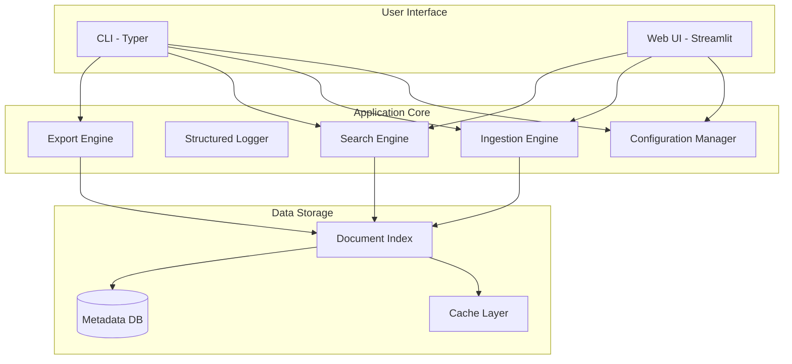

# PDF Context Narrator

A Python 3.11+ production-ready CLI and web tool for ingesting, searching, and analyzing PDF documents with structured logging, multiple deployment profiles, and comprehensive monitoring.

## Features

- 📥 **Ingest**: Process and index PDF documents with parallel processing
- 🔍 **Search**: Query indexed documents with powerful search capabilities
- 📄 **Summarize**: Generate summaries of PDF content
- 📅 **Timeline**: Create chronological views of document events
- 📤 **Export**: Export data in multiple formats (JSON, CSV, Markdown)
- 🌐 **Web UI**: Optional Streamlit-based web interface
- 📊 **Structured Logging**: JSON logging with operation tracking
- ⚙️ **Config Profiles**: Pre-configured profiles for local, offline, and cloud deployments
- 🔒 **Security**: Built-in security scanning and best practices
- 🚀 **CI/CD**: Automated testing and deployment pipelines

## Architecture

### High-Level System Design



See [Architecture Documentation](docs/ARCHITECTURE.md) for detailed system design.

## Project Structure

```
pdf_context_narrator/
├── src/
│   └── pdf_context_narrator/
│       ├── __init__.py
│       ├── __main__.py
│       ├── cli.py          # CLI interface with Typer
│       ├── config.py       # Configuration with profile support
│       └── logger.py       # Structured logging
├── streamlit_app/          # Optional web UI
│   ├── app.py             # Streamlit application
│   └── README.md
├── tests/                  # Test suite
│   ├── test_cli.py
│   ├── test_config.py
│   ├── test_logger.py
│   └── test_e2e.py        # End-to-end integration tests
├── configs/                # Configuration profiles
│   ├── local.yaml         # Local development
│   ├── offline.yaml       # Offline mode
│   └── cloud.yaml         # Cloud deployment
├── docs/                   # Documentation
│   ├── ARCHITECTURE.md    # System architecture
│   └── TROUBLESHOOTING.md # Troubleshooting guide
├── .github/
│   └── workflows/
│       └── ci.yml         # CI/CD pipeline
├── .env.example           # Environment variables template
├── requirements.txt       # Core dependencies
├── requirements-streamlit.txt  # Optional UI dependencies
├── pyproject.toml         # Project configuration
└── README.md              # This file
```

## Prerequisites

- Python 3.11 or higher
- pip (Python package manager)

## Installation

1. Clone the repository:
```bash
git clone https://github.com/wesire/PDF-Scanner.git
cd PDF-Scanner
```

2. Create and activate a virtual environment (recommended):
```bash
python3.11 -m venv venv
source venv/bin/activate  # On Windows: venv\Scripts\activate
```

3. Install dependencies:
```bash
pip install -r requirements.txt
pip install -e .
```

4. (Optional) Install Streamlit UI:
```bash
pip install -r requirements-streamlit.txt
```

5. Configure environment variables:
```bash
cp .env.example .env
# Edit .env with your preferred settings
```

## Configuration

The application supports three deployment profiles and environment-based configuration.

### Configuration Profiles

#### Local Profile (Development)
```bash
python -m pdf_context_narrator --profile local ingest ./pdfs/
```
- Verbose logging
- Local file storage
- Debug mode enabled

#### Offline Profile (Air-gapped)
```bash
python -m pdf_context_narrator --profile offline ingest ./pdfs/
```
- No external dependencies
- Local storage only
- Standard logging

#### Cloud Profile (Production)
```bash
python -m pdf_context_narrator --profile cloud ingest ./pdfs/
```
- Structured JSON logging
- Cloud storage support
- Production optimizations

### Environment Variables

All settings are prefixed with `PDF_CN_`:

| Variable | Default | Description |
|----------|---------|-------------|
| `PDF_CN_DATA_DIR` | `data` | Data storage directory |
| `PDF_CN_CACHE_DIR` | `cache` | Cache directory |
| `PDF_CN_LOGS_DIR` | `logs` | Log files directory |
| `PDF_CN_LOG_LEVEL` | `INFO` | Logging level (DEBUG, INFO, WARNING, ERROR) |
| `PDF_CN_MAX_WORKERS` | `4` | Number of parallel workers |
| `PDF_CN_STRUCTURED_LOGGING` | `false` | Enable JSON structured logs |
| `PDF_CN_ENVIRONMENT` | `local` | Environment (local, offline, cloud) |

See `.env.example` for all available options.

### Custom Configuration

Create a custom YAML configuration file:

```yaml
# custom.yaml
app_name: my-pdf-processor
log_level: DEBUG
max_workers: 8
structured_logging: true
```

Use it with:
```bash
python -m pdf_context_narrator --config custom.yaml ingest ./pdfs/
```

## Usage

The application provides both a CLI and an optional web interface.

### Command-Line Interface (CLI)

#### Running the Application

You can run the application in several ways:

```bash
# Method 1: As a module
python -m pdf_context_narrator [COMMAND] [OPTIONS]

# Method 2: Direct execution
python src/pdf_context_narrator/cli.py [COMMAND] [OPTIONS]
```

### Available Commands

#### 1. Ingest PDFs

Process and index PDF documents:

```bash
# Ingest a single PDF file
python -m pdf_context_narrator ingest path/to/document.pdf

# Ingest all PDFs in a directory
python -m pdf_context_narrator ingest path/to/pdfs/

# Recursively ingest PDFs from subdirectories
python -m pdf_context_narrator ingest path/to/pdfs/ --recursive

# Force re-ingestion of already processed files
python -m pdf_context_narrator ingest path/to/pdfs/ --force
```

#### 2. Search Documents

Search through indexed documents:

```bash
# Basic search
python -m pdf_context_narrator search "your search query"

# Limit number of results
python -m pdf_context_narrator search "your query" --limit 20

# Output as JSON
python -m pdf_context_narrator search "your query" --format json
```

#### 3. Summarize Documents

Generate document summaries:

```bash
# Summarize a document
python -m pdf_context_narrator summarize path/to/document.pdf

# Create a longer summary
python -m pdf_context_narrator summarize path/to/document.pdf --length long

# Save summary to file
python -m pdf_context_narrator summarize path/to/document.pdf --output summary.txt
```

#### 4. Generate Timeline

Create chronological views:

```bash
# Generate timeline for all documents
python -m pdf_context_narrator timeline

# Filter by date range
python -m pdf_context_narrator timeline --start 2024-01-01 --end 2024-12-31

# Save timeline to file
python -m pdf_context_narrator timeline --output timeline.json
```

#### 5. Export Data

Export indexed data in various formats:

```bash
# Export to JSON
python -m pdf_context_narrator export json output.json

# Export to CSV
python -m pdf_context_narrator export csv output.csv

# Export to Markdown
python -m pdf_context_narrator export markdown output.md

# Export with filter
python -m pdf_context_narrator export json output.json --filter "status:processed"
```

### Global Options

All commands support these global options:

```bash
# Enable verbose output
python -m pdf_context_narrator --verbose [COMMAND]

# Use configuration profile
python -m pdf_context_narrator --profile local [COMMAND]

# Use custom config file
python -m pdf_context_narrator --config path/to/config.yaml [COMMAND]

# Enable structured JSON logging
python -m pdf_context_narrator --structured-logs [COMMAND]

# Show help
python -m pdf_context_narrator --help

# Show help for a specific command
python -m pdf_context_narrator [COMMAND] --help
```

### Web Interface (Optional)

Launch the Streamlit-based web UI:

```bash
streamlit run streamlit_app/app.py
```

The web interface provides:
- **📥 Upload View**: Drag-and-drop PDF upload with batch processing
- **🔍 Search View**: Interactive search with filters and result preview
- **📖 Narrative View**: Generate and export comprehensive document narratives
- **⚙️ Settings View**: Configure application settings through the UI

Access the UI at `http://localhost:8501`

See [streamlit_app/README.md](streamlit_app/README.md) for more details.

## Examples

Here are some complete workflow examples:

### Example 1: Process and Search PDFs

```bash
# 1. Ingest PDFs from a directory
python -m pdf_context_narrator ingest ./documents/ --recursive

# 2. Search for specific content
python -m pdf_context_narrator search "machine learning" --limit 5

# 3. Export results
python -m pdf_context_narrator export json results.json
```

### Example 2: Summarize Multiple Documents

```bash
# Process PDFs and generate summaries
python -m pdf_context_narrator ingest ./reports/
python -m pdf_context_narrator summarize ./reports/report1.pdf --output summary1.txt
python -m pdf_context_narrator summarize ./reports/report2.pdf --output summary2.txt
```

### Example 3: Timeline Analysis

```bash
# Ingest documents with date metadata
python -m pdf_context_narrator ingest ./historical-docs/ --recursive

# Generate timeline for specific period
python -m pdf_context_narrator timeline --start 2023-01-01 --end 2023-12-31 --output timeline.json
```

### Example 4: Using Configuration Profiles

```bash
# Development with verbose logging
python -m pdf_context_narrator --profile local --verbose ingest ./pdfs/

# Production with structured logging
python -m pdf_context_narrator --profile cloud --structured-logs ingest ./pdfs/

# Offline mode (no external APIs)
python -m pdf_context_narrator --profile offline ingest ./pdfs/
```

### Example 5: End-to-End Workflow

```bash
# Complete workflow: ingest -> search -> summarize -> export
python -m pdf_context_narrator ingest ./documents/ --recursive
python -m pdf_context_narrator search "important topic" --limit 10 --format json
python -m pdf_context_narrator summarize ./documents/key-doc.pdf --output summary.md
python -m pdf_context_narrator export markdown report.md
```

## Development

### Running Tests

```bash
# Install development dependencies
pip install pytest pytest-cov

# Run all tests
pytest tests/ -v

# Run with coverage
pytest --cov=pdf_context_narrator tests/ --cov-report=html

# Run end-to-end tests only
pytest tests/test_e2e.py -v

# Run specific test
pytest tests/test_cli.py::test_ingest_command -v
```

### Code Quality

```bash
# Format code
black src/ tests/

# Lint code
ruff check src/ tests/

# Type checking
mypy src/ --ignore-missing-imports
```

### Continuous Integration

The project uses GitHub Actions for CI/CD:

- **Testing**: Automated tests on Python 3.11 and 3.12
- **Linting**: Code quality checks with Black, Ruff, and mypy
- **Security**: Dependency and code security scanning
- **Coverage**: Code coverage reporting

See [.github/workflows/ci.yml](.github/workflows/ci.yml) for pipeline details.

## Troubleshooting

### Quick Diagnostics

```bash
# Check installation
python -c "import pdf_context_narrator; print('OK')"

# Verify configuration
python -m pdf_context_narrator --help

# Enable debug logging
python -m pdf_context_narrator --verbose ingest ./pdfs/

# Use structured logs for analysis
python -m pdf_context_narrator --structured-logs ingest ./pdfs/ 2>&1 | jq .
```

### Common Issues

#### Module Not Found
```bash
# Reinstall in development mode
pip install -e .
```

#### Permission Errors
```bash
# Check directory permissions
ls -la data/ cache/ logs/

# Create directories manually
mkdir -p data cache logs
chmod 755 data cache logs
```

#### Configuration Issues
```bash
# Use a known-good profile
python -m pdf_context_narrator --profile local ingest ./pdfs/

# Check configuration
python -c "from pdf_context_narrator.config import get_settings; print(get_settings())"
```

#### Performance Issues
```bash
# Reduce worker count
export PDF_CN_MAX_WORKERS=2

# Clear cache
rm -rf cache/*

# Use batch processing
export PDF_CN_BATCH_SIZE=5
```

### Getting Help

For detailed troubleshooting steps, see [docs/TROUBLESHOOTING.md](docs/TROUBLESHOOTING.md).

Common resources:
- **Architecture**: [docs/ARCHITECTURE.md](docs/ARCHITECTURE.md)
- **Issues**: [GitHub Issues](https://github.com/wesire/PDF-Scanner/issues)
- **Discussions**: [GitHub Discussions](https://github.com/wesire/PDF-Scanner/discussions)

## Documentation

- [Architecture Documentation](docs/ARCHITECTURE.md) - System design and components
- [Troubleshooting Guide](docs/TROUBLESHOOTING.md) - Common issues and solutions
- [Streamlit UI Guide](streamlit_app/README.md) - Web interface documentation
- [Contributing Guide](CONTRIBUTING.md) - Contribution guidelines

## Current Status

⚠️ **Note**: This is currently a scaffolding implementation with production-ready infrastructure. Core business logic for PDF processing will be implemented in future releases. The following are fully functional:

✅ **Implemented**:
- CLI framework with Typer
- Configuration management with profiles
- Structured logging with operation tracking
- Streamlit web UI (stub)
- End-to-end test framework
- CI/CD pipeline
- Comprehensive documentation

🚧 **In Progress**:
- PDF text extraction
- Vector database integration
- LLM-based summarization
- Advanced search capabilities

## Roadmap

- [ ] Implement PDF text extraction with pypdf/pdfplumber
- [ ] Add vector database for semantic search (Chroma/FAISS)
- [ ] Implement summarization using LLMs (OpenAI/Hugging Face)
- [ ] Add support for document metadata extraction
- [ ] Integrate web UI with backend logic
- [ ] Add support for multiple document formats (DOCX, TXT, HTML)
- [ ] Implement authentication and authorization
- [ ] Add real-time processing dashboard
- [ ] Support for distributed processing
- [ ] Multi-language support

## Contributing

Contributions are welcome! Please feel free to submit a Pull Request.

1. Fork the repository
2. Create your feature branch (`git checkout -b feature/amazing-feature`)
3. Commit your changes (`git commit -m 'Add amazing feature'`)
4. Push to the branch (`git push origin feature/amazing-feature`)
5. Open a Pull Request

See [CONTRIBUTING.md](CONTRIBUTING.md) for detailed guidelines.

## License

This project is licensed under the MIT License - see the [LICENSE](LICENSE) file for details.

## Support

For issues, questions, or contributions:

- **Issues**: [GitHub Issues](https://github.com/wesire/PDF-Scanner/issues)
- **Discussions**: [GitHub Discussions](https://github.com/wesire/PDF-Scanner/discussions)
- **Documentation**: Check [docs/](docs/) directory
- **Email**: Open an issue for support requests

## Acknowledgments

Built with:
- [Typer](https://typer.tiangolo.com/) - CLI framework
- [Pydantic](https://docs.pydantic.dev/) - Data validation
- [Streamlit](https://streamlit.io/) - Web UI framework
- [pytest](https://pytest.org/) - Testing framework