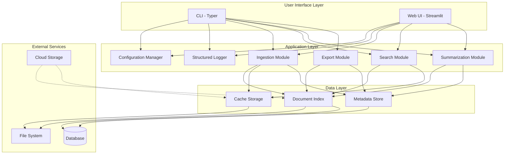
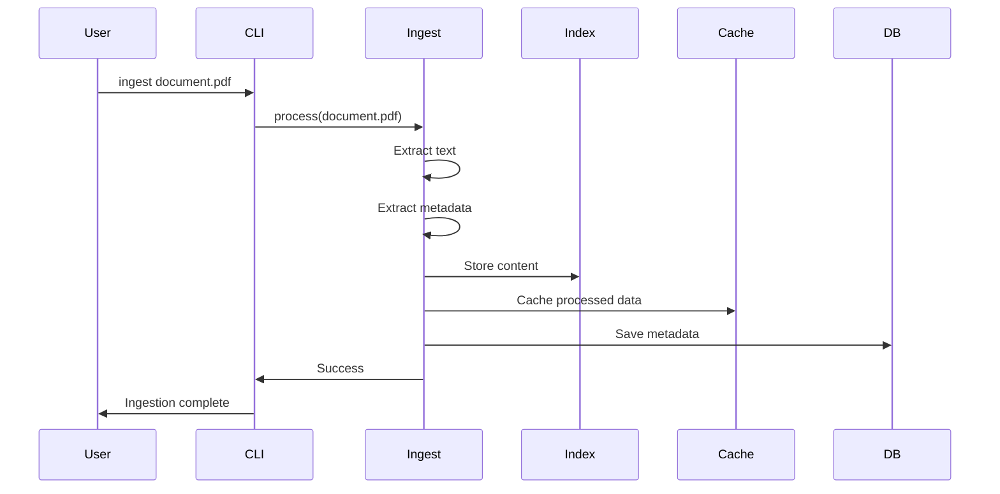
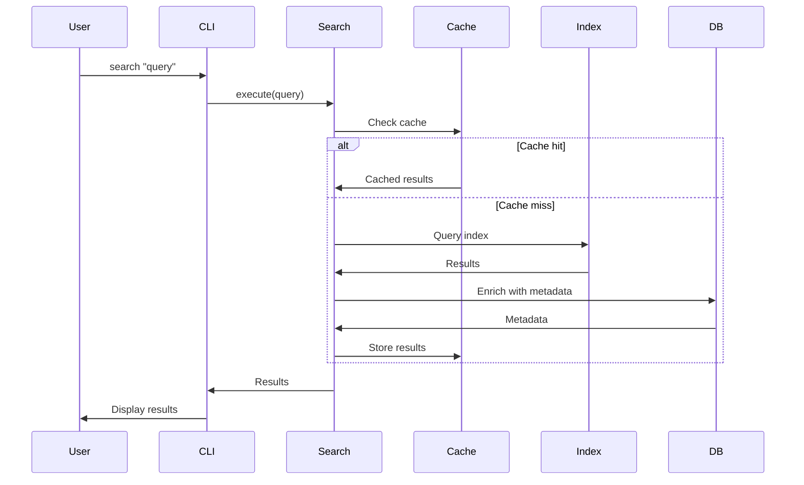
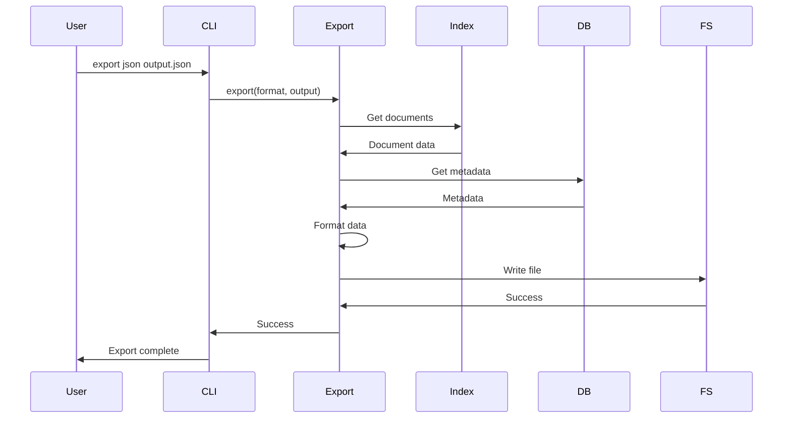

# Architecture Documentation

## System Architecture

### High-Level Architecture



## Component Details

### 1. User Interface Layer

#### CLI (Command-Line Interface)
- **Technology**: Typer
- **Purpose**: Primary interface for PDF processing operations
- **Features**:
  - Command-based interaction
  - Rich help system
  - Configuration profiles support
  - Structured logging options

#### Web UI (Streamlit)
- **Technology**: Streamlit
- **Purpose**: Optional graphical interface
- **Features**:
  - File upload interface
  - Interactive search
  - Narrative view generation
  - Settings management

### 2. Application Layer

#### Configuration Manager
- **Location**: `src/pdf_context_narrator/config.py`
- **Purpose**: Centralized configuration management
- **Features**:
  - Environment-based configuration
  - YAML profile support (local/offline/cloud)
  - Settings validation with Pydantic
  - Dynamic configuration reload

#### Structured Logger
- **Location**: `src/pdf_context_narrator/logger.py`
- **Purpose**: Application-wide logging with structured output
- **Features**:
  - JSON structured logging
  - Operation ID tracking
  - Context-aware logging
  - Multiple output formats

#### Processing Modules
- **Ingestion**: PDF document intake and indexing
- **Search**: Full-text and semantic search
- **Summarization**: Document summary generation
- **Export**: Multi-format data export (JSON, CSV, Markdown)

### 3. Data Layer

#### Document Index
- **Purpose**: Fast document retrieval and search
- **Storage**: File system + optional database
- **Features**:
  - Inverted index for full-text search
  - Metadata indexing
  - Incremental updates

#### Cache Storage
- **Purpose**: Performance optimization
- **Storage**: Local file system
- **Features**:
  - Processed document caching
  - Search result caching
  - Configurable TTL

#### Metadata Store
- **Purpose**: Document metadata and relationships
- **Storage**: Database (SQLite/PostgreSQL)
- **Features**:
  - Document properties
  - Processing status
  - Relationships and references

## Configuration Profiles

### Local Profile
- **Use Case**: Development and testing
- **Storage**: Local file system
- **Logging**: Verbose, file-based
- **Features**: Debug mode, hot reload

### Offline Profile
- **Use Case**: Air-gapped or offline environments
- **Storage**: Local file system only
- **Logging**: Standard, file-based
- **Features**: No external dependencies

### Cloud Profile
- **Use Case**: Production deployment
- **Storage**: Cloud storage (S3, GCS, Azure)
- **Logging**: Structured JSON to stdout
- **Features**: Horizontal scaling, distributed processing

## Data Flow

### Ingestion Flow


### Search Flow


### Export Flow


## Technology Stack

### Core Technologies
- **Python**: 3.11+
- **CLI Framework**: Typer
- **Web Framework**: Streamlit (optional)
- **Configuration**: Pydantic Settings
- **Logging**: Python logging + JSON formatting

### Development Tools
- **Testing**: pytest, pytest-cov
- **Linting**: ruff, black
- **Type Checking**: mypy
- **CI/CD**: GitHub Actions

### Future Technologies (Planned)
- **PDF Processing**: pypdf, pdfplumber
- **Vector DB**: Chroma, FAISS
- **LLM Integration**: OpenAI API, Hugging Face
- **Database**: SQLAlchemy (SQLite/PostgreSQL)

## Security Considerations

### Data Security
- Configuration secrets via environment variables
- No hardcoded credentials
- Secure file permissions for data directories
- Optional encryption for sensitive data

### API Security
- API key rotation support
- Rate limiting (when applicable)
- Input validation and sanitization
- HTTPS for external API calls

### Access Control
- File system permission checks
- User authentication (future)
- Role-based access control (future)

## Scalability

### Vertical Scaling
- Configurable worker threads
- Memory-efficient processing
- Streaming for large files

### Horizontal Scaling (Cloud)
- Stateless application design
- External storage backends
- Distributed processing support
- Load balancer ready

## Performance Optimization

### Caching Strategy
- Multi-level caching (memory, disk)
- Intelligent cache invalidation
- Configurable TTL per cache type

### Indexing Strategy
- Incremental indexing
- Background processing
- Batch operations
- Index optimization

### Database Optimization
- Connection pooling
- Query optimization
- Index on frequently queried fields
- Periodic vacuum/optimize

## Monitoring and Observability

### Logging
- Structured JSON logs
- Operation ID tracking
- Performance metrics
- Error tracking with stack traces

### Metrics (Future)
- Processing throughput
- Search latency
- Cache hit rates
- Error rates

### Health Checks
- Application health endpoint
- Database connectivity
- Storage availability
- External service status

## Deployment Patterns

### Local Development
```bash
# Install dependencies
pip install -r requirements.txt
pip install -e .

# Run with local profile
python -m pdf_context_narrator --profile local ingest ./pdfs/
```

### Docker Deployment
```dockerfile
FROM python:3.11-slim
WORKDIR /app
COPY . .
RUN pip install -r requirements.txt
CMD ["python", "-m", "pdf_context_narrator"]
```

### Cloud Deployment
- Container orchestration (Kubernetes, ECS)
- Managed storage (S3, GCS)
- Managed database (RDS, Cloud SQL)
- Log aggregation (CloudWatch, Stackdriver)

## Extension Points

### Custom Processors
- Plugin architecture for custom PDF processors
- Configurable processing pipelines
- Pre/post processing hooks

### Custom Exporters
- Pluggable export formats
- Template-based exports
- Custom transformations

### Custom Storage Backends
- Abstract storage interface
- Multiple backend support
- Cloud storage adapters

## Migration Strategy

### Version Compatibility
- Backward compatible configuration
- Data migration scripts
- Schema versioning

### Upgrade Path
1. Backup existing data
2. Update dependencies
3. Run migration scripts
4. Validate data integrity
5. Update configuration

## Best Practices

### Development
- Use type hints
- Write comprehensive tests
- Follow PEP 8 style guide
- Document public APIs
- Use meaningful variable names

### Configuration
- Use environment variables for secrets
- Maintain separate configs per environment
- Version control configuration templates
- Document all configuration options

### Operations
- Monitor logs regularly
- Set up alerts for errors
- Regular backups
- Test disaster recovery
- Document runbooks
